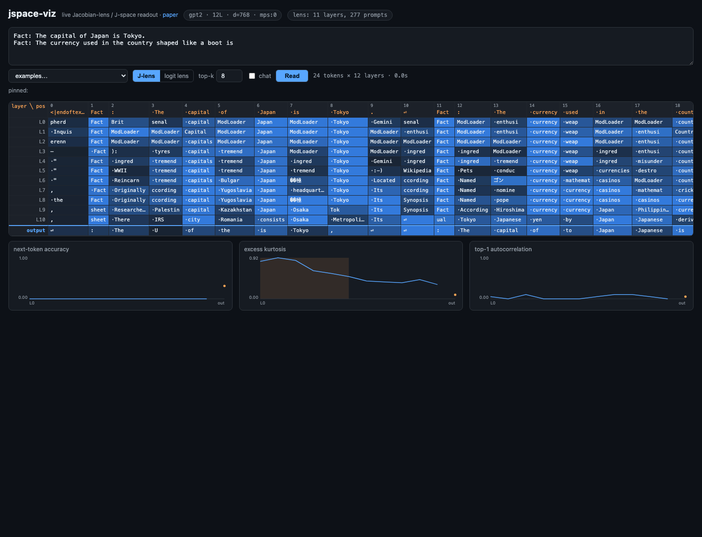

# jspace-viz

**Live J-space / Jacobian-lens visualizer for open-weights language models.**

**[▶ Try the demo](https://festyve.github.io/jspace-viz/)** — serverless
demo of **deepseek-coder-1.3b** (40-prompt lens fit on a laptop; GPT-2
comparison page linked in its header) with precomputed example prompts — full
UI: lens toggle, workspace panel, click-to-trace ranks, model continuations.
Run locally to type your own prompts at any model.

Type a prompt, watch what every layer of the model is *disposed to say* at
every token position — the "verbalizable workspace" from Anthropic's
[*Verbalizable Representations Form a Global Workspace in Language
Models*](https://transformer-circuits.pub/2026/workspace/index.html)
(Gurnee et al., 2026) — rendered as an interactive layer × position heatmap,
with one-click comparison against the vanilla logit lens and live plots of the
paper's workspace-band signatures.



## What the Jacobian lens is

The residual stream at layer `l` lives in a different basis than the final
layer, so decoding it directly with the unembedding (the classic *logit lens*)
breaks down in early and middle layers. The Jacobian lens first transports the
activation into the final-layer basis using the **average input–output
Jacobian** over a text corpus:

```
lens_l(h) = unembed( J_l @ h ),    J_l = E[ ∂h_final / ∂h_l ]
```

The expectation runs over prompts, source positions, and all current-and-later
target positions. The rows of `W_U · J_l` are the **J-lens vectors** — one
direction per vocabulary token — and the set of sparse non-negative
combinations of them is the **J-space**, the paper's candidate for a global
workspace: the small, verbalizable, causally load-bearing slice of the model's
state.

This repo is an **independent implementation** of the estimator described in
the paper and its [official reference code](https://github.com/anthropics/jacobian-lens)
(Anthropic PBC, Apache-2.0). The on-disk lens format is byte-compatible in
both directions, so the prebaked community lenses that
[Neuronpedia publishes on the Hub](https://huggingface.co/neuronpedia/jacobian-lens)
load directly, and lenses fit here load in the official tooling.

**Validation** — `scripts/validate_lens.py` fits Pythia-70m on 8 WikiText
prompts and compares against Neuronpedia's 1000-prompt lens (fit with the
official code, on a B200):

| layer | 0 | 1 | 2 | 3 | 4 |
|---|---|---|---|---|---|
| cos(J_ours, J_ref) | 0.66 | 0.76 | 0.89 | 0.94 | 0.98 |

Rising toward 1.0 with layer is the expected convergence pattern (early-layer
Jacobians have the highest per-prompt variance), confirming the estimators
match.

## Quick start — type anything

```bash
git clone https://github.com/Festyve/jspace-viz && cd jspace-viz
uv venv && uv pip install -e '.[fit]'

# DeepSeek + this repo's published lens (both auto-download, ~3 GB total)
.venv/bin/jspace-viz --preset deepseek-coder-1.3b
# → open http://127.0.0.1:8321 and type any prompt

# or the featherweight instant version (GPT-2 + Neuronpedia lens, ~600 MB)
.venv/bin/jspace-viz --preset gpt2
```

## How to read the screen (start here)

Type any prompt — anything at all — and hit **Read**. The grid is the model's
processing unrolled:

- **Each column is one token of your prompt** (`·` marks a leading space,
  `⏎` a newline). **Each row is one layer**, shallow at the top; the
  blue-bordered bottom row is what the model *actually says next*.
- **Each cell answers**: "if the model had to speak from this layer at this
  position, what word would come out?" Bluer = more confident.
- **🧠 "in the workspace right now"** is the shortcut for *what is it thinking
  about*: mid-layer concepts that are **not** words from your prompt and
  **not** the literal next word — i.e. content the model is holding, not
  copying. On the multi-hop boot example, GPT-2's workspace contains currency
  concepts before any currency word is ever said. Click a chip to trace it.
- **Click any cell (or chip)** to switch to a **rank heatmap** for that token:
  `★0` = the #1 thing on the model's mind at that (layer, position); 30000 =
  not a thought at all. Watch a concept *ignite* mid-stack — the paper's
  rank-tracking charts, live.
- **J-lens ↔ logit lens** toggle: the same grid without the Jacobian
  transport. Mid-layer cells collapse into filler — that contrast is the
  paper's contribution.
- **hover** a cell for its full top-k readout, entropy (H) and excess
  kurtosis (spikiness).
- **charts** (x = depth): next-token accuracy stays ~0 until late layers
  (early layers don't predict words); excess kurtosis humps in the middle —
  the shaded region is the heuristic **workspace band** where verbalizable
  content lives; autocorrelation measures whether neighboring positions share
  a thought.

Caveat: GPT-2 is a small 2019 model — its workspace is genuinely murky (you
will see word-fragments among the readouts). It's the instant demo. The
DeepSeek preset (and anything ≥1B, e.g. the prebaked Gemma/Llama lenses) reads
far cleaner.

## DeepSeek (or any other model)

No public DeepSeek lens existed, so this repo fits its own. On an Apple-Silicon
laptop (16 GB is enough for a ~1.3B model — fitting backprops through the model
`d_model` times per prompt):

```bash
# checkpointed + resumable; writes a usable partial lens after every prompt
.venv/bin/python scripts/fit_lens.py --preset deepseek-coder-1.3b --n-prompts 40 --dim-batch 16
.venv/bin/jspace-viz --preset deepseek-coder-1.3b
```

Presets (see `jspace_viz/presets.py` — any HF causal LM with a Llama-style,
GPT-2, or NeoX layout works via `--model-id` + `--lens`):

| preset | model | lens | runs on |
|---|---|---|---|
| `gpt2` | gpt2 (124M) | prebaked (Neuronpedia) | anything |
| `pythia-70m` | Pythia-70m | prebaked (Neuronpedia) | anything |
| `deepseek-coder-1.3b` | deepseek-coder-1.3b-instruct | prebaked ([Festyve/jspace-lenses](https://huggingface.co/Festyve/jspace-lenses)) or refit locally | 16 GB laptop |
| `gemma-3-1b-it` | Gemma-3-1B-it (gated) | prebaked (Neuronpedia) | 16 GB laptop |
| `llama-3.1-8b-it` | Llama-3.1-8B-it (gated) | prebaked (Neuronpedia) | 24 GB+ GPU |
| `deepseek-r1-distill-llama-8b` | R1-Distill-Llama-8B | fit yourself | A100-class GPU |

Corpus follows the Neuronpedia convention (WikiText-103 stream, ≤128 tokens,
first 16 positions skipped as attention sinks). Quality saturates fast: the
paper reports ~10 prompts already beats the logit lens, ~100 is solid, 1000 is
what they ship. Empirically even the **1-prompt partial lens** already beats
the logit lens on deepseek-coder-1.3b: on "The capital of France is" it reads
` Paris` top-1 from layer 16 of 24, while the logit lens still reads generic
filler (` usually`, ` either`) at the same depths.

## Host it as a website

Two options:

- **Serverless demo (free)** — `python scripts/export_static.py --preset gpt2`
  precomputes the grids (with full rank tables, so pin/trace works without a
  backend) for the example prompts into `docs/`, ready for GitHub Pages or any
  static host. That's what the [live demo](https://festyve.github.io/jspace-viz/)
  is. Visitors can't type new prompts — everything else works.
- **Full app (needs a real machine)** — the server holds a model in memory, so
  free serverless tiers (Vercel/Netlify) can't run it. The included
  `Dockerfile` deploys anywhere Docker runs; on Hugging Face, Docker Spaces
  require a PRO subscription as of mid-2026.

## Roadmap

- in-browser type-anything demo: GPT-2 under WebGPU (transformers.js/ONNX) with
  shipped `J_l` matrices, so the free static site no longer needs precomputed
  prompts
- J-space sparse decomposition (gradient pursuit, k ≤ 25) per cell
- interventions: J-lens-vector swaps/steering (the paper's thought-swap protocol)
- role–filler binding probes on top of the workspace readout

## Credits & license

- Paper: Gurnee et al., *Verbalizable Representations Form a Global Workspace
  in Language Models*, Transformer Circuits, 2026.
- Reference implementation: [anthropics/jacobian-lens](https://github.com/anthropics/jacobian-lens) (Apache-2.0).
  The estimator here follows it; three demo prompts in `presets.py` are adapted
  from its examples.
- Prebaked lenses: [neuronpedia/jacobian-lens](https://huggingface.co/neuronpedia/jacobian-lens) on the Hub.

Code: Apache-2.0 (see `LICENSE`).
